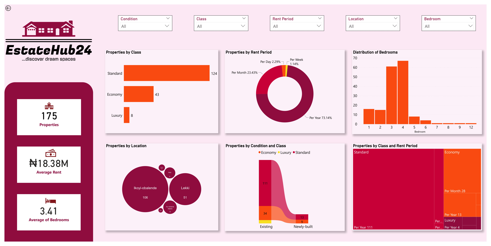

# Web Scraping a Property Listing Website

## Introduction
This project leverages Python's versatility in performing web scraping and data cleaning operations before analysis and visualization was completed in Power BI. Real-time data from [Property24](https://www.property24.com.ng/1-bedroom-properties-to-rent-in-lagos-p37?), a local property listings website was scrapped. The goal of the project was to make a single-page dashboard that helps property renters and potential home dwellers find their dream homes.
## Skills demonstrated
The following Python skills were incorporated into this project.
- Importing Python libraries.
- Web page retrieval.
- HTML parsing.
- Handling dynamic content.
- Data extraction and storage.
- Data cleaning.

The following Power BI skills were also incorporated into this project.
- Data transformation.
- Knowledge of DAX functions.
- Drill-through page
- Data analysis and visualization.
## Data sourcing
The data was obtained via scrapping of rental properties on [Property24](https://www.property24.com.ng/1-bedroom-properties-to-rent-in-lagos-p37?), a local property listing website. On the website, the location was set to 'Lagos', and the number of beds was set to '1+' in order to achieve the project's aim. Applying these filters on the website reduced results to just 181 properties. This was done to avoid overloading the website with requests, ensuring a smoother and more considerate scraping process that respects the website's server capacity and performance.

A well-commented [Python script](https://github.com/emmywritescode/Web-Scraping-a-Property-Listing-Website/blob/main/Web%20Scraping%20a%20Property%20Listing%20Website.ipynb) was crafted within Jupyter Notebook, employing essential libraries like BeautifulSoup, Selenium's WebDriver, and Pandas. A base URL  was initiated which iterated through web pages, gathering desired data into predefined lists. The loop ceased once pages no longer met the scraping criteria. The dataset comprises 191 rows and 5 columns, following the data extraction process. Finally, the data was stored in a data frame and exported as a CSV file.
## Data cleaning and Data transformation
The data cleaning process began with the removal of the leading and trailing spaces within the dataset. Records of some commercial properties were also obtained in the scrapping process and they were dropped. A separate column 'Bedroom' was created to store the number of bedrooms in each property. To clean the Price column, a function was defined to take care of the '₦' prefix and the spaces while some price values were adjusted properly to align with the data consistency. A function was also defined to replace null values in the Location column  with information from the Name column. The Location column was then adjusted to retain only the city where the properties are located. Lastly, duplicate values were dropped. Overall this process reduced the records to a tidy 175. The script can be read [here](https://github.com/emmywritescode/Web-Scraping-a-Property-Listing-Website/blob/main/Cleaning%20the%20Dataset.ipynb).

The data was further transformed in the Power Query Editor on Power BI. The 'Period' column was renamed to 'Rent Period', the 'Price' column was renamed to 'Rent' and values were formatted to the appropriate currency. A conditional column called 'Condition' was created, which classifies properties into 'Newly-built' and 'Existing' based on the presence of words like 'New' and 'Newly' in the 'Detail' column. Another conditional column called 'Class' was created using DAX, which groups properties into 'Economy,' 'Standard,' and 'Luxury' based on the corresponding Rent Period and Rent.
## Analysis and Visualization
Analysis revealed the following:
- There are 175 properties of which 153 are Existing and only 22 are Newly-built.
- 73.1% of the properties give potential home dwellers the opportunity to pay rent on a 'Per Year' basis and 23.4% allow rent to be paid on a 'Per Month' basis.
- Most of the properties are classed as 'Standard' (124) while there are only 8 Luxury properties based on the Rent and Rent Period.
- Most of the properties are either 3 or 4-bedroom apartments.
- There are no Newly-built luxury properties.
- The majority of the properties are located in Ikoyi-Obalende area of Lagos.
- Standard class properties are not available for rent on a 'Per Week' basis.

The interactive dashboard can be accessed [here]().
## Conclusion
The dashboard offers a comprehensive overview of rental properties listed on Estate Hub 24. The use of interactive filters enables potential renters to narrow down their choices based on available listings. Additionally, a drill-through page provides further details for each property, including the exact rent based on the rental period. Overall, the dashboard has made it easy for everyone to find their dream home without any hassle.

